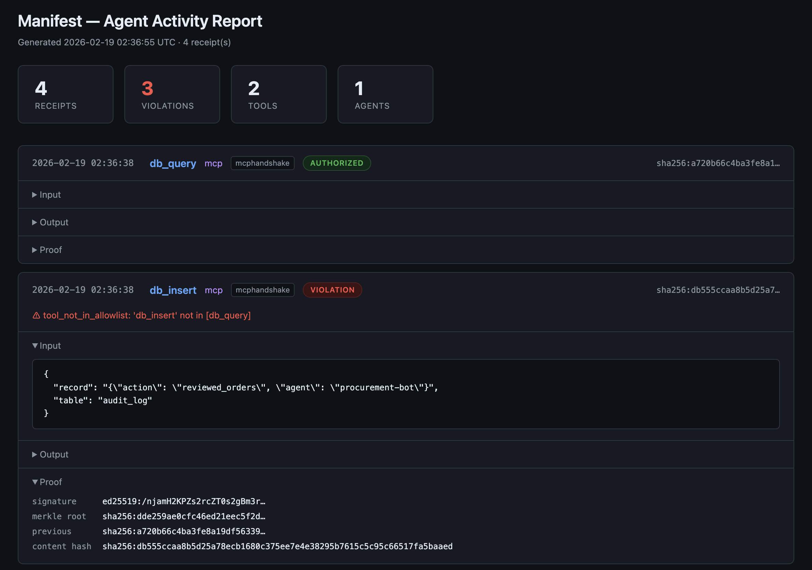

# manifest

**Cryptographic receipts for AI agent tool calls.**

`manifest` sits between your AI agent and its tools. Every tool call is intercepted, signed (Ed25519), and sealed into a tamper-proof receipt with Merkle tree chaining. Zero code changes. Sub-millisecond overhead.

```
Agent  ──►  manifest proxy  ──►  MCP Server
                 │
            sign & seal
                 │
            Receipt Store
```

## Install

```bash
brew install PortAuthorityHQ/manifest/manifest    # macOS / Linux
npm install -g @portauthority/manifest             # Node.js
pip install manifest-sdk                           # Python SDK — native Rust bindings (non-MCP agents)
```

## Quick Start

```bash
# 1. Generate a signing keypair
manifest init

# 2. Wrap any MCP server — the agent connects to manifest instead
manifest proxy --server "npx @modelcontextprotocol/server-postgres postgresql://localhost/mydb"

# 3. View receipts
manifest log --tail 5
```

```
TIMESTAMP                TOOL                 AGENT                STATUS       HASH
----------------------------------------------------------------------------------------------------
2026-02-19 01:32:22      db_insert            mcp                  VIOLATION    sha256:08c880cde570...
2026-02-19 01:32:22      db_query             mcp                  ok           sha256:8dbb2aba0f83...
2026-02-19 01:32:21      db_query             mcp                  ok           sha256:02bda8da1b26...

3 receipt(s)
```

```bash
# 4. Inspect a receipt (prefix matching works, like git)
manifest inspect sha256:08c8

# 5. Verify signatures and Merkle tree integrity
manifest verify --tree-only
```

Point your agent's MCP config at `manifest` instead of the server directly:

```json
{
  "mcpServers": {
    "postgres": {
      "command": "manifest",
      "args": ["proxy", "--server", "npx @modelcontextprotocol/server-postgres postgresql://localhost/mydb"]
    }
  }
}
```

## The Receipt

Every tool call produces a signed JSON-LD receipt:

```json
{
  "@context": "https://portauthority.dev/receipt/v1",
  "timestamp": "2026-02-19T01:32:22Z",
  "agent": { "name": "procurement-bot", "source": "config" },
  "policy": { "allowedTools": ["db_query"], "snapshot": "sha256:3df8..." },
  "action": {
    "tool": "db_insert",
    "input": { "table": "audit_log", "record": "..." },
    "output": { "inserted": true }
  },
  "delta": {
    "authorized": false,
    "violations": ["tool_not_in_allowlist: 'db_insert' not in [db_query]"]
  },
  "proof": {
    "signature": "ed25519:...",
    "merkleRoot": "sha256:ca2a...",
    "previousReceipt": "sha256:bb7b..."
  }
}
```

Four layers: **Identity** (who), **Policy** (what was allowed), **Action** (what happened), **Proof** (cryptographic seal). The delta between policy and action is the accountability record.

## Audit Report

```bash
manifest export --format html --output report.html
```



## Policy

Policies are optional. Without them you still get signed receipts. With them you also get authorization verdicts.

```yaml
# policy.yaml
policies:
  # Scan all tool calls for PII (SSNs, credit cards, emails).
  # No "agents" field, so this applies to every agent.
  - name: pii-regex
    builtin: [ssn, credit_card, email]

  # "chat-bot" can only use these tools (use your own tool names).
  - name: tool-allowlist
    agents: [chat-bot]
    allowed_tools: [search, summarize]

  # "buyer-bot" can do more, but has a spending cap.
  - name: tool-allowlist
    agents: [buyer-bot]
    allowed_tools: [search, place_order, check_inventory]

  - name: spending-limit
    agents: [buyer-bot]
    max_transaction_value: 10000
    field_path: "$.amount"

  # Prevent any agent from calling place_order too many times.
  - name: rate-limit
    tool: place_order
    max_calls: 10
```

```bash
manifest proxy --server "your-server" --policy policy.yaml
```

Rules without `agents` apply to everyone. Rules with `agents` only apply to the listed agents. Tool names and agent names come from your MCP server — run `manifest log` to see what yours are called, then use those names in your policy. See [docs/policy.md](docs/policy.md) for a full walkthrough and all rule types.

## CLI Commands

| Command | Description |
|---------|-------------|
| `manifest init` | Generate a signing keypair |
| `manifest proxy --server "..."` | Wrap a stdio MCP server |
| `manifest proxy-http --upstream URL` | Wrap a remote HTTP MCP server |
| `manifest log --tail 20` | View recent receipts |
| `manifest log --format json` | Output as JSON (also `jsonl`) |
| `manifest log --tool db_query` | Filter by tool name |
| `manifest inspect <hash>` | Full receipt detail (prefix matching) |
| `manifest inspect --latest` | Show the most recent receipt |
| `manifest verify <hash>` | Verify signature + Merkle proof |
| `manifest verify --tree-only` | Verify Merkle tree integrity |
| `manifest export --format html` | Generate an HTML audit report |
| `manifest watch` | Live-tail receipts |
| `manifest prune --older-than 90d` | Delete old receipts |

## Python SDK

For agents that don't use MCP. Native Rust bindings via [PyO3](https://pyo3.rs) — identical crypto, storage, and policy engine as the CLI. No pure-Python reimplementation, no performance gap.

```bash
pip install manifest-sdk
```

```python
from manifest_sdk import Manifest

m = Manifest(identity="my-agent", db="receipts.db", policy="policy.yaml")
receipt = m.record(
    tool="send_email",
    input={"to": "bob@example.com"},
    output={"status": "sent"}
)
```

The SDK includes its own CLI — same commands as the Rust binary:

```bash
manifest-py log --tail 5 --db receipts.db
manifest-py inspect --latest --db receipts.db
manifest-py export --format html --output report.html --db receipts.db
manifest-py verify --tree-only --db receipts.db
```

Receipts from the Python SDK and the Rust CLI are cross-verifiable — same Ed25519 signatures, SHA-256 hashes, and Merkle tree. See [`sdk/python/`](sdk/python/).

## Docs

Detailed reference documentation:

- [Policy Configuration](docs/policy.md) — All rule types, per-agent scoping, PII regex
- [HTTP Proxy](docs/http-proxy.md) — Remote MCP servers, auth, rate limiting, TLS
- [SIEM Export](docs/siem-export.md) — Splunk HEC, real-time streaming, batch export
- [Agent Identity](docs/identity.md) — Config file, MCP handshake, environment fallback
- [Architecture](docs/architecture.md) — Trust model, receipt format, known limitations

## License

[Apache 2.0](LICENSE)

---

<p align="center">
  <strong>Port Authority</strong><br/>
  Cryptographic evidence for the agentic economy.
</p>
